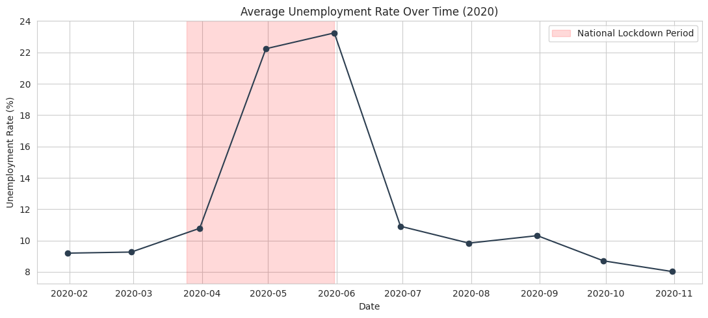
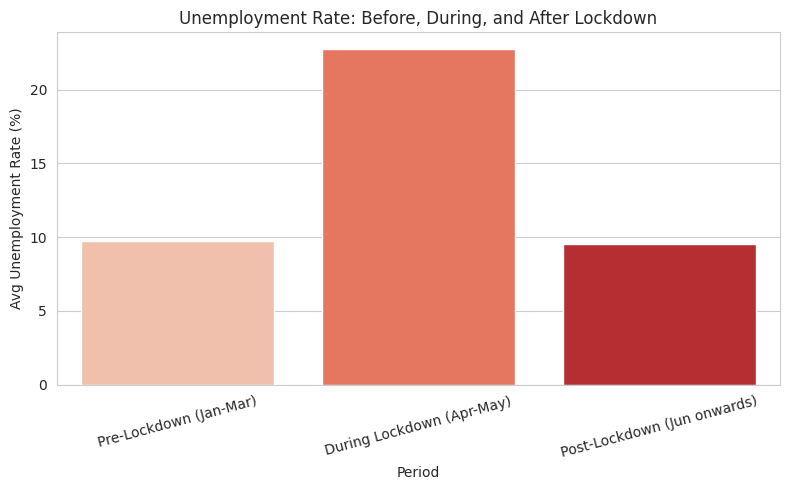
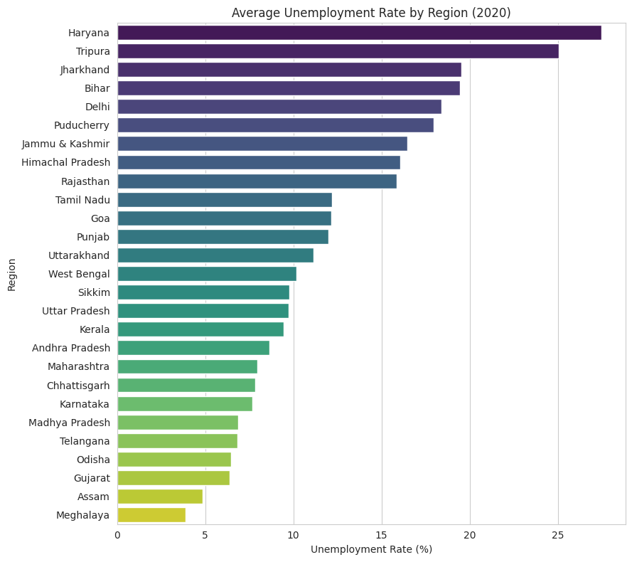
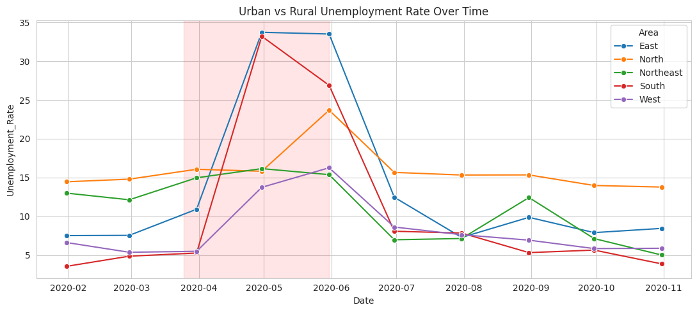

# Unemployment Analysis with Python

## About
This project was completed as part of my Data Science internship at CodeAlpha.

## Problem Statement
Analyze unemployment rate trends across Indian states during 2020, with a focus on the impact of the Covid-19 lockdown, and identify regional and urban/rural patterns.

## Dataset
267 records covering 27 Indian regions from February to October 2020, including unemployment rate, estimated employed population, and labour participation rate, split by urban/rural area.

## Approach
- Data loading, cleaning, and date parsing
- National unemployment trend over time, with lockdown period highlighted
- Pre-lockdown vs during-lockdown vs post-lockdown comparison
- Regional comparison across all 27 states
- Labour participation rate vs unemployment rate relationship
- Urban vs rural unemployment trend comparison

## Results & Key Insights
- **Unemployment spiked dramatically during lockdown: 9.76% (pre-lockdown) → 22.75% (during lockdown, Apr-May) → 9.56% (post-lockdown recovery)**
- Highest average unemployment: Haryana (27.48%)
- Lowest average unemployment: Meghalaya (3.87%)
- Significant regional disparity in how hard different states were hit
- Urban and rural areas showed different recovery patterns after the lockdown eased

## Policy Implication
The sharp spike-and-recovery pattern, combined with major regional disparity, suggests economic relief during similar disruptions should be regionally targeted rather than applying a single uniform national approach.

## Tools Used
Python, pandas, matplotlib, seaborn

## How to Run
1. Clone this repo
2. Install requirements: `pip install -r requirements.txt`
3. Open `notebook/unemployment_analysis.ipynb` in Jupyter or Google Colab
4. Run all cells

## Video Explanation
[Add your LinkedIn video link here after posting]
